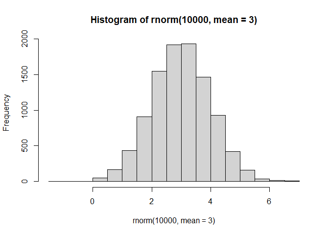
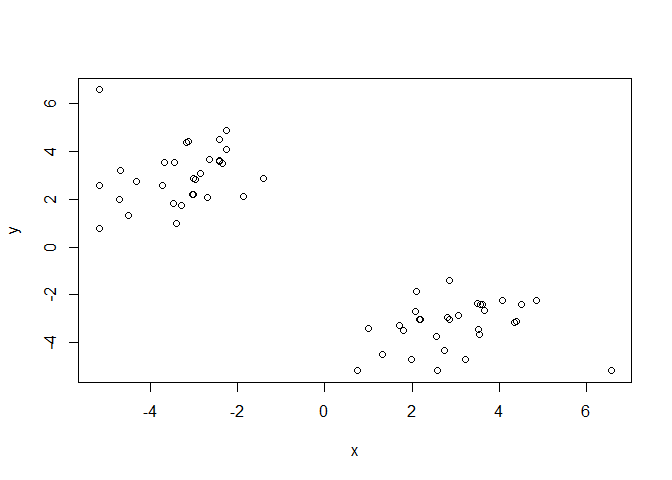
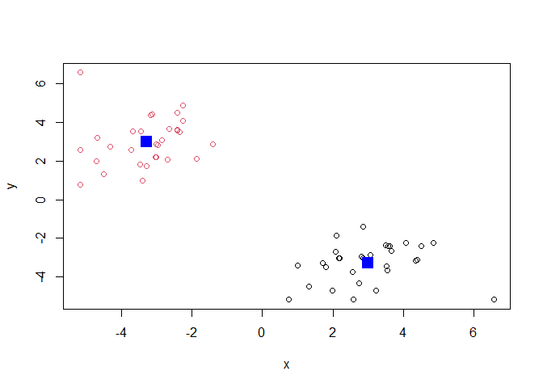
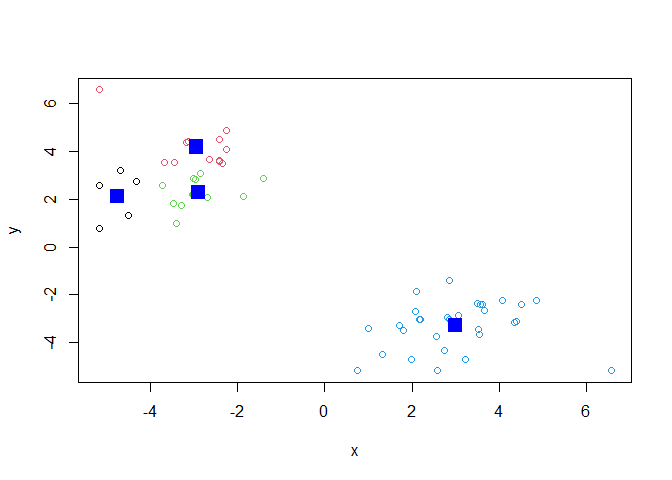
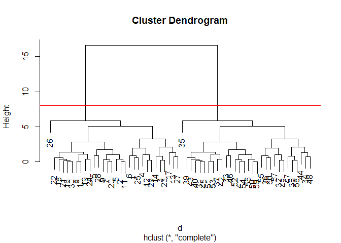
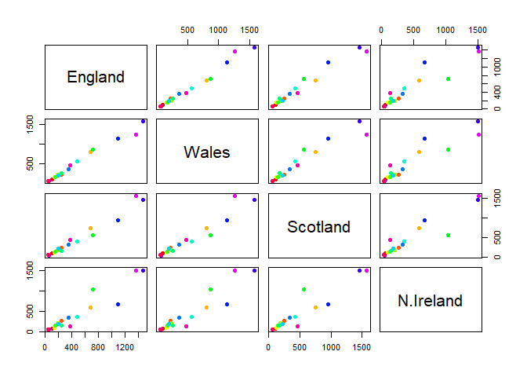
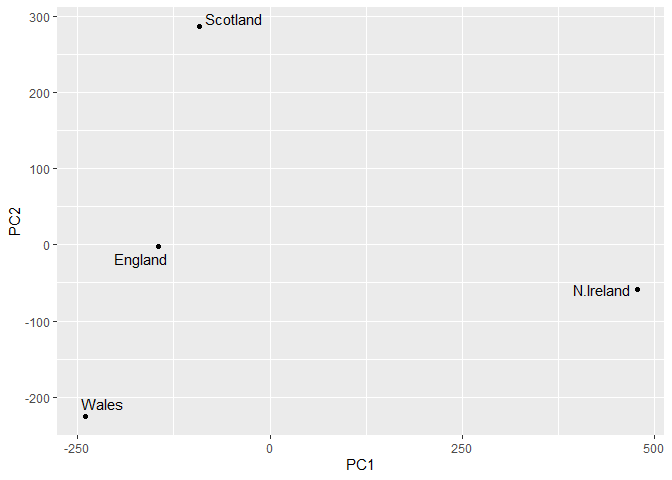

# Class 7: Machine Learning 1
Peter

- [Clustering](#clustering)
  - [K-means](#k-means)
  - [Hierarchical Clustering](#hierarchical-clustering)
- [Principal Component Analysis
  (PCA)](#principal-component-analysis-pca)
  - [Data import](#data-import)
  - [PCA to the rescue](#pca-to-the-rescue)

Today we will explore unsupervised machine learning methods starting
with clustering and dimensionality reduction.

## Clustering

To start let’s make up some data to cluster where we know what the
answer should be. The `rnorm()` function will help us here.

``` r
hist(rnorm(10000, mean=3))
```



Return 30 numbers centered on -3 and make a plot

``` r
tmp <- c(rnorm(30, mean=-3), rnorm(30, mean=3))
x <- cbind(x=tmp, y=rev(tmp))
plot(x)
```



### K-means

The main function in base R for k-means clustering is called `kmeans()`:

``` r
km <- kmeans(x, centers=2)
km
```

    K-means clustering with 2 clusters of sizes 30, 30

    Cluster means:
              x         y
    1  2.998372 -3.285218
    2 -3.285218  2.998372

    Clustering vector:
     [1] 2 2 2 2 2 2 2 2 2 2 2 2 2 2 2 2 2 2 2 2 2 2 2 2 2 2 2 2 2 2 1 1 1 1 1 1 1 1
    [39] 1 1 1 1 1 1 1 1 1 1 1 1 1 1 1 1 1 1 1 1 1 1

    Within cluster sum of squares by cluster:
    [1] 74.57595 74.57595
     (between_SS / total_SS =  88.8 %)

    Available components:

    [1] "cluster"      "centers"      "totss"        "withinss"     "tot.withinss"
    [6] "betweenss"    "size"         "iter"         "ifault"      

The `kmeans()` function returns a “list” of 9 components. You can see
the named components of any list with the `attributes` function.

``` r
attributes(km)
```

    $names
    [1] "cluster"      "centers"      "totss"        "withinss"     "tot.withinss"
    [6] "betweenss"    "size"         "iter"         "ifault"      

    $class
    [1] "kmeans"

> Q. How many points are in each cluster?

``` r
km$size
```

    [1] 30 30

> Q. Cluster assignment vector?

``` r
km$cluster
```

     [1] 2 2 2 2 2 2 2 2 2 2 2 2 2 2 2 2 2 2 2 2 2 2 2 2 2 2 2 2 2 2 1 1 1 1 1 1 1 1
    [39] 1 1 1 1 1 1 1 1 1 1 1 1 1 1 1 1 1 1 1 1 1 1

> Q. Cluster centers?

``` r
km$centers
```

              x         y
    1  2.998372 -3.285218
    2 -3.285218  2.998372

> Q. Make a plot of our `kmeans` results sharing cluster assignment
> using different colors for each cluster/group of points and cluster
> centers in blue.

``` r
plot(x, col=km$cluster)
points(km$centers, col="blue", pch=15, cex=2)
```



> Q. Run `kmeans()` again and this time cluster into 4 groups and plot
> the same result figure as above

``` r
km4 <- kmeans(x, centers=4)
plot(x, col=km4$cluster)
points(km4$centers, col="blue", pch=15, cex=2)
```



> **key-point**: K-means clustering is super popular but can be misused.
> One big limitation is that it can impose a clustering pattern on your
> data even if clear natural grouping doesn’t exist - i.e. it does what
> you tell it to do it terms of `centers`.

### Hierarchical Clustering

The main function in base R for hierarchical clustering is called
`hclust()`.

You can’t just pass our dataset as is into `hclust()`; you must give
“distance matrix” as input. We can get this from the `dist()` function
in R

``` r
d <- dist(x)
hc <- hclust(d)
hc
```


    Call:
    hclust(d = d)

    Cluster method   : complete 
    Distance         : euclidean 
    Number of objects: 60 

The results of `hclust()` don’t have a useful `print()` method but do
have a special `plot()` method.

``` r
plot(hc)
abline(h=8, col="red")
```



To get our main cluster assignment (membership vector) we need to cut
the tree at the goal posts…

``` r
grps <- cutree(hc, h=8)
grps
```

     [1] 1 1 1 1 1 1 1 1 1 1 1 1 1 1 1 1 1 1 1 1 1 1 1 1 1 1 1 1 1 1 2 2 2 2 2 2 2 2
    [39] 2 2 2 2 2 2 2 2 2 2 2 2 2 2 2 2 2 2 2 2 2 2

``` r
table(grps)
```

    grps
     1  2 
    30 30 

Hierarchical Clustering is distinct in that the dendrogram can reveal
the potential grouping in your data (unlike K-means) 😩

## Principal Component Analysis (PCA)

PCA is a common and highly useful dimensionality reduction technique
used in many fields - particularly bioinformatics.

Here we will analyse some data from the UK on food consumption

### Data import

``` r
url <- "https://tinyurl.com/UK-foods"
x <- read.csv(url, row.names = 1)
```

``` r
head(x)
```

                   England Wales Scotland N.Ireland
    Cheese             105   103      103        66
    Carcass_meat       245   227      242       267
    Other_meat         685   803      750       586
    Fish               147   160      122        93
    Fats_and_oils      193   235      184       209
    Sugars             156   175      147       139

``` r
barplot(as.matrix(x), beside=F, col=rainbow(nrow(x)))
```


We can also use a pairs plot

``` r
pairs(x, col=rainbow(nrow(x)), pch = 16)
```



### PCA to the rescue

The main function in base R for PCA is called `prcomp()`.

``` r
pca <- prcomp(t(x))
summary(pca)
```

    Importance of components:
                                PC1      PC2      PC3       PC4
    Standard deviation     324.1502 212.7478 73.87622 3.176e-14
    Proportion of Variance   0.6744   0.2905  0.03503 0.000e+00
    Cumulative Proportion    0.6744   0.9650  1.00000 1.000e+00

The `prcomp()` function returns a list object of our results with five
attributes

``` r
attributes(pca)
```

    $names
    [1] "sdev"     "rotation" "center"   "scale"    "x"       

    $class
    [1] "prcomp"

The two main results in here are `pca$x` and `pca$rotation`. The first
of these (`pca$x`) contains the scores of the data on the new PC axis -
we use these to make our “PCA plot”.

``` r
pca$x
```

                     PC1         PC2        PC3           PC4
    England   -144.99315   -2.532999 105.768945 -4.894696e-14
    Wales     -240.52915 -224.646925 -56.475555  5.700024e-13
    Scotland   -91.86934  286.081786 -44.415495 -7.460785e-13
    N.Ireland  477.39164  -58.901862  -4.877895  2.321303e-13

``` r
library(ggplot2)
library(ggrepel)
ggplot(pca$x) + 
  aes(PC1, PC2, label=rownames(pca$x)) +
  geom_point() +
  geom_text_repel()
```



The second major result is contained in the `pca$rotation` object. Let’s
plot this to see what PCA is picking up…

``` r
ggplot(pca$rotation) + 
  aes(PC1, rownames(pca$rotation)) + 
  geom_col()
```


The above plot shows how N.Ireland fares compared to Great Britain
