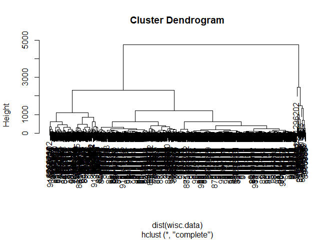
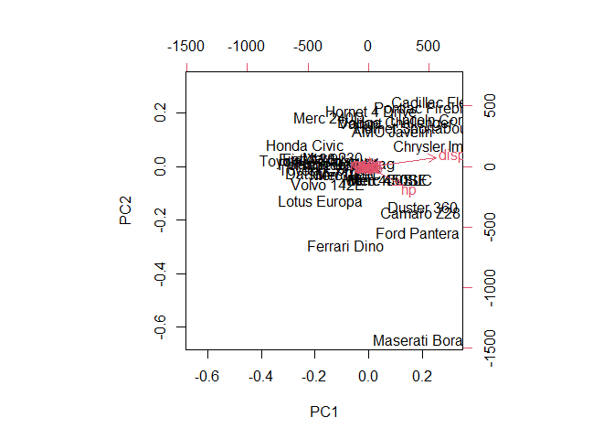
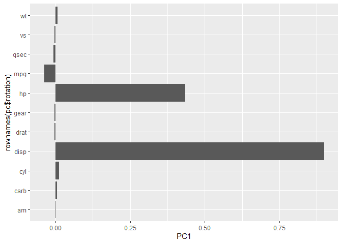
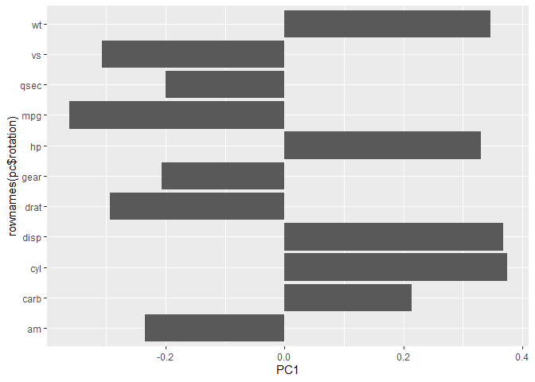
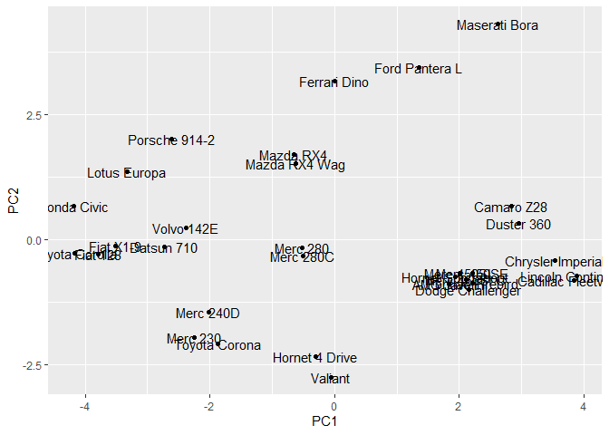
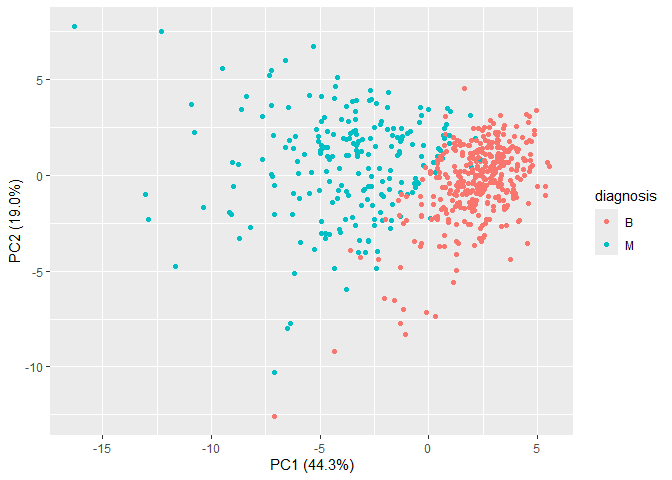
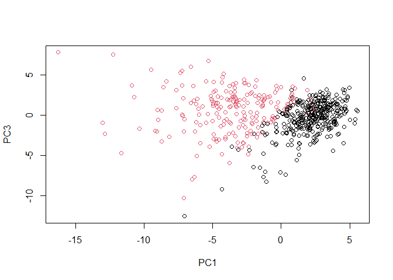
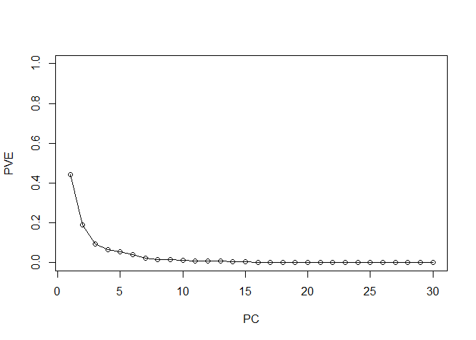

# Class08 - Unsupervised Learning
Peter

- [Unsupervised Learning for Breast Cancer Cell
  Analysis](#unsupervised-learning-for-breast-cancer-cell-analysis)
  - [Data Import](#data-import)
  - [Clustering](#clustering)
  - [Principal Component Analysis](#principal-component-analysis)
    - [The importance of data scaling](#the-importance-of-data-scaling)
    - [PCA of wisc.data](#pca-of-wiscdata)
  - [Variance Explained](#variance-explained)
  - [Combining Methods](#combining-methods)

# Unsupervised Learning for Breast Cancer Cell Analysis

This document outlines a class mini-project focused on unsupervised
learning analysis of human breast cancer cell data. Students will employ
techniques like exploratory data analysis, Principle Component Analysis
(PCA) for dimensionality recuction, and hierarchical clustering to
identify potential groupings within the data. An optional section
includes K-means clustering and the project culminates in combining
these methods and evaluating their sensitivity and specificity for
potential prediction on new samples. The goal is to apply learned
unsupervised learning concepts to a real world biological dataset.

## Data Import

Our data comes from the U. of Wisconsin Medical Center

``` r
wisc.df <- read.csv("WisconsinCancer.csv", row.names = 1)
head(wisc.df)
```

             diagnosis radius_mean texture_mean perimeter_mean area_mean
    842302           M       17.99        10.38         122.80    1001.0
    842517           M       20.57        17.77         132.90    1326.0
    84300903         M       19.69        21.25         130.00    1203.0
    84348301         M       11.42        20.38          77.58     386.1
    84358402         M       20.29        14.34         135.10    1297.0
    843786           M       12.45        15.70          82.57     477.1
             smoothness_mean compactness_mean concavity_mean concave.points_mean
    842302           0.11840          0.27760         0.3001             0.14710
    842517           0.08474          0.07864         0.0869             0.07017
    84300903         0.10960          0.15990         0.1974             0.12790
    84348301         0.14250          0.28390         0.2414             0.10520
    84358402         0.10030          0.13280         0.1980             0.10430
    843786           0.12780          0.17000         0.1578             0.08089
             symmetry_mean fractal_dimension_mean radius_se texture_se perimeter_se
    842302          0.2419                0.07871    1.0950     0.9053        8.589
    842517          0.1812                0.05667    0.5435     0.7339        3.398
    84300903        0.2069                0.05999    0.7456     0.7869        4.585
    84348301        0.2597                0.09744    0.4956     1.1560        3.445
    84358402        0.1809                0.05883    0.7572     0.7813        5.438
    843786          0.2087                0.07613    0.3345     0.8902        2.217
             area_se smoothness_se compactness_se concavity_se concave.points_se
    842302    153.40      0.006399        0.04904      0.05373           0.01587
    842517     74.08      0.005225        0.01308      0.01860           0.01340
    84300903   94.03      0.006150        0.04006      0.03832           0.02058
    84348301   27.23      0.009110        0.07458      0.05661           0.01867
    84358402   94.44      0.011490        0.02461      0.05688           0.01885
    843786     27.19      0.007510        0.03345      0.03672           0.01137
             symmetry_se fractal_dimension_se radius_worst texture_worst
    842302       0.03003             0.006193        25.38         17.33
    842517       0.01389             0.003532        24.99         23.41
    84300903     0.02250             0.004571        23.57         25.53
    84348301     0.05963             0.009208        14.91         26.50
    84358402     0.01756             0.005115        22.54         16.67
    843786       0.02165             0.005082        15.47         23.75
             perimeter_worst area_worst smoothness_worst compactness_worst
    842302            184.60     2019.0           0.1622            0.6656
    842517            158.80     1956.0           0.1238            0.1866
    84300903          152.50     1709.0           0.1444            0.4245
    84348301           98.87      567.7           0.2098            0.8663
    84358402          152.20     1575.0           0.1374            0.2050
    843786            103.40      741.6           0.1791            0.5249
             concavity_worst concave.points_worst symmetry_worst
    842302            0.7119               0.2654         0.4601
    842517            0.2416               0.1860         0.2750
    84300903          0.4504               0.2430         0.3613
    84348301          0.6869               0.2575         0.6638
    84358402          0.4000               0.1625         0.2364
    843786            0.5355               0.1741         0.3985
             fractal_dimension_worst
    842302                   0.11890
    842517                   0.08902
    84300903                 0.08758
    84348301                 0.17300
    84358402                 0.07678
    843786                   0.12440

> Q1. How many patients/samples are in the dataset?

``` r
nrow(wisc.df)
```

    [1] 569

> Q2. How many of the observations have a malignant diagnosis?

``` r
table(wisc.df$diagnosis)
```


      B   M 
    357 212 

> Q3. How many variables in the data are suffixed with \_mean?

``` r
grep("_mean", colnames(wisc.df))
```

     [1]  2  3  4  5  6  7  8  9 10 11

``` r
length(grep("_mean", colnames(wisc.df)))
```

    [1] 10

There is a diagnosis column that is the clinician consensus that I want
to exclude from my further analysis. We will come back later and compare
our results to this diagnosis

``` r
diagnosis <- as.factor(wisc.df$diagnosis)
head(diagnosis)
```

    [1] M M M M M M
    Levels: B M

Now we can remove it from the wisc.df dataset

``` r
wisc.data <- wisc.df[,-1]
```

## Clustering

Let’s try a `hclust()`

``` r
hc <- hclust(dist(wisc.data))
plot(hc)
```



We can extract clusters from the this awful dendrogram with the
`cutree()` function

``` r
grps <- cutree(hc, k=2)
table(grps)
```

    grps
      1   2 
    549  20 

We can generate a cross-table that compares our cluster `grps` vector
with our `diagnosis` vector values.

``` r
table(diagnosis, grps)
```

             grps
    diagnosis   1   2
            B 357   0
            M 192  20

## Principal Component Analysis

The main function for PCA in base R is `prcomp()`, it has a default
input parameter of `scale=FALSE`.

### The importance of data scaling

``` r
#prcomp()
head(mtcars)
```

                       mpg cyl disp  hp drat    wt  qsec vs am gear carb
    Mazda RX4         21.0   6  160 110 3.90 2.620 16.46  0  1    4    4
    Mazda RX4 Wag     21.0   6  160 110 3.90 2.875 17.02  0  1    4    4
    Datsun 710        22.8   4  108  93 3.85 2.320 18.61  1  1    4    1
    Hornet 4 Drive    21.4   6  258 110 3.08 3.215 19.44  1  0    3    1
    Hornet Sportabout 18.7   8  360 175 3.15 3.440 17.02  0  0    3    2
    Valiant           18.1   6  225 105 2.76 3.460 20.22  1  0    3    1

We could do a PCA of this data as is and it could be mis-leading.

``` r
pc <- prcomp(mtcars)
biplot(pc)
```



Let’s look at the mean values of each column and their standard
deviation.

``` r
colMeans(mtcars)
```

           mpg        cyl       disp         hp       drat         wt       qsec 
     20.090625   6.187500 230.721875 146.687500   3.596563   3.217250  17.848750 
            vs         am       gear       carb 
      0.437500   0.406250   3.687500   2.812500 

``` r
apply(mtcars, 2, sd)
```

            mpg         cyl        disp          hp        drat          wt 
      6.0269481   1.7859216 123.9386938  68.5628685   0.5346787   0.9784574 
           qsec          vs          am        gear        carb 
      1.7869432   0.5040161   0.4989909   0.7378041   1.6152000 

We can scale this data before PCA to get a much better representation
and analysis of all the columns.

``` r
mtscale <- scale(mtcars)
colMeans(mtscale)
```

              mpg           cyl          disp            hp          drat 
     7.112366e-17 -1.474515e-17 -9.085614e-17  1.040834e-17 -2.918672e-16 
               wt          qsec            vs            am          gear 
     4.682398e-17  5.299580e-16  6.938894e-18  4.510281e-17 -3.469447e-18 
             carb 
     3.165870e-17 

``` r
apply(mtscale, 2, sd)
```

     mpg  cyl disp   hp drat   wt qsec   vs   am gear carb 
       1    1    1    1    1    1    1    1    1    1    1 

``` r
pc.scale <- prcomp(mtscale)
```

We can look at the two main results figures from PCA - the “PC Plot”
(a.k.a score plot, orientation plot, or PC1 vs PC2 plot). A loading plot
of the unscaled PCA results…

``` r
library(ggplot2)
ggplot(pc$rotation) +
  aes(PC1, rownames(pc$rotation)) +
  geom_col()
```



``` r
ggplot(pc.scale$rotation) +
  aes(PC1, rownames(pc$rotation)) +
  geom_col()
```



PC plot of scaled PCA results

``` r
ggplot(pc.scale$x) + 
  aes(PC1, PC2, label=rownames(pc.scale$x)) +
  geom_point() +
  geom_text()
```



> **Key point**: In general we will set `scale=TRUE` when we do PCA.
> This is not the default but probably should be.

We can check the SD and mean of the different columns in `wisc.data` to
see if we need to scale - hint: we do!

### PCA of wisc.data

``` r
wisc.pr <- prcomp(wisc.data, scale=TRUE)
summary(wisc.pr)
```

    Importance of components:
                              PC1    PC2     PC3     PC4     PC5     PC6     PC7
    Standard deviation     3.6444 2.3857 1.67867 1.40735 1.28403 1.09880 0.82172
    Proportion of Variance 0.4427 0.1897 0.09393 0.06602 0.05496 0.04025 0.02251
    Cumulative Proportion  0.4427 0.6324 0.72636 0.79239 0.84734 0.88759 0.91010
                               PC8    PC9    PC10   PC11    PC12    PC13    PC14
    Standard deviation     0.69037 0.6457 0.59219 0.5421 0.51104 0.49128 0.39624
    Proportion of Variance 0.01589 0.0139 0.01169 0.0098 0.00871 0.00805 0.00523
    Cumulative Proportion  0.92598 0.9399 0.95157 0.9614 0.97007 0.97812 0.98335
                              PC15    PC16    PC17    PC18    PC19    PC20   PC21
    Standard deviation     0.30681 0.28260 0.24372 0.22939 0.22244 0.17652 0.1731
    Proportion of Variance 0.00314 0.00266 0.00198 0.00175 0.00165 0.00104 0.0010
    Cumulative Proportion  0.98649 0.98915 0.99113 0.99288 0.99453 0.99557 0.9966
                              PC22    PC23   PC24    PC25    PC26    PC27    PC28
    Standard deviation     0.16565 0.15602 0.1344 0.12442 0.09043 0.08307 0.03987
    Proportion of Variance 0.00091 0.00081 0.0006 0.00052 0.00027 0.00023 0.00005
    Cumulative Proportion  0.99749 0.99830 0.9989 0.99942 0.99969 0.99992 0.99997
                              PC29    PC30
    Standard deviation     0.02736 0.01153
    Proportion of Variance 0.00002 0.00000
    Cumulative Proportion  1.00000 1.00000

Let’s make the main PC1 vs PC2 figure…

``` r
ggplot(wisc.pr$x) + 
  aes(PC1, PC2, col=diagnosis) +
  geom_point() +
  xlab("PC1 (44.3%)") +
  ylab("PC2 (19.0%)")
```



> Q4. From your results, what proportion of the original variance is
> captured by PC1?

44.27%

> Q5. How many PCs are required to describe at least 70% of the original
> variance of the data?

3 (By adding PC1 + PC2 + PC3)

> Q6. How many PCs are required to describe at least 90% of the original
> variance of the data?

7 (Using similar method as Q5)

``` r
biplot(wisc.pr)
```


> Q7. What stands out about this plot? Is it easy or difficult to
> understand? Why?

The plot is nit visually appealing and it is difficult to interpret
data. The labels are also obstructive and make it even more messy.

We can make a scatter plot so it is not as messy

``` r
plot(wisc.pr$x, col=diagnosis, xlab="PC1", ylab="PC2")
```


> Q8. Generate a similar plot for PC 1 and 3. What do you notice?

``` r
plot(wisc.pr$x[,1:3], col=diagnosis, xlab="PC1", ylab="PC3")
```



The first plot (PC1 vs PC2) has less overlap and the groups are more
distinct

We can use ggplot for more fancy results

``` r
df <- as.data.frame(wisc.pr$x)
df$diagnosis <- diagnosis

library(ggplot2)

ggplot(df) + 
  aes(PC1, PC2, col=diagnosis) + 
  geom_point()
```


## Variance Explained

``` r
pr.var <- wisc.pr$sdev^2
head(pr.var)
```

    [1] 13.281608  5.691355  2.817949  1.980640  1.648731  1.207357

``` r
pve <- pr.var / sum(pr.var)

plot(pve, xlab = "PC", ylab = "PVE", ylim = c(0,1), type = "o")
```



> Q9. For PC1, what is the component of the loading vector for the
> feature concave.points_mean?

wisc.pr\$rotation\[,9\]

> Q10. What is the minimum number of PCs required to explain 80% of the
> variance of the data?

5 (by adding PC1 + … + PC5)

## Combining Methods

``` r
wisc.pr.hclust <- hclust(dist(wisc.pr$x[,1:2]), method="ward.D2")
pc.grps <- cutree(wisc.pr.hclust, k=2)
table(pc.grps)
```

    pc.grps
      1   2 
    195 374 

How do my cluster grps compare to the expert diagnosis?

``` r
table(diagnosis, pc.grps)
```

             pc.grps
    diagnosis   1   2
            B  18 339
            M 177  35

``` r
table(diagnosis)
```

    diagnosis
      B   M 
    357 212 
