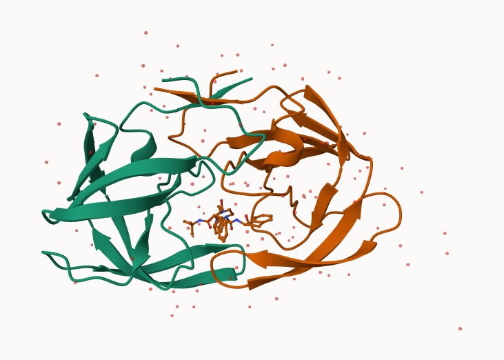

# Class 10 - Structural Bioinformatics
Peter Sax

- [1. Introduction to PDB](#1-introduction-to-pdb)
- [2. Visualizing with Mol-star](#2-visualizing-with-mol-star)
- [4. Comparative Structure Analysis](#4-comparative-structure-analysis)

## 1. Introduction to PDB

The main repository of bio-molecular structure data is called the
[Protein Data Bank](https://www.rcsb.org/) (PDB). It is the second
oldest database ever (after GenBank)

What is currently in the PDB? We can access current composition stats
[here](https://www.rcsb.org/stats)

``` r
pdb.stats <- read.csv("Data Export Summary.csv", row.names=1)
head(pdb.stats)
```

                              X.ray     EM    NMR Multiple.methods Neutron Other
    Protein (only)          171,959 18,083 12,622              210      84    32
    Protein/Oligosaccharide  10,018  2,968     34               10       2     0
    Protein/NA                8,847  5,376    286                7       0     0
    Nucleic acid (only)       2,947    185  1,535               14       3     1
    Other                       170     10     33                0       0     0
    Oligosaccharide (only)       11      0      6                1       0     4
                              Total
    Protein (only)          202,990
    Protein/Oligosaccharide  13,032
    Protein/NA               14,516
    Nucleic acid (only)       4,685
    Other                       213
    Oligosaccharide (only)       22

> Q1: What percentage of structures in the PDB are solved by X-Ray and
> Electron Microscopy.

``` r
comma.sum <- function(x){
  y <- gsub(",","",x)
  return(sum(as.numeric(y)))}

(comma.sum(pdb.stats$X.ray) + comma.sum(pdb.stats$EM)) / (comma.sum(pdb.stats$Total)) * 100
```

    [1] 93.6787

> Q2: What proportion of structures in the PDB are protein?

``` r
comma.sum(pdb.stats["Protein (only)","Total"]) / comma.sum(pdb.stats[,"Total"])
```

    [1] 0.862107

## 2. Visualizing with Mol-star

Mol (pronounced “molstar”) is a new web-based molecular viewer that is
rapidly gaining in popularity and utility. At the time of writing it is
still a long way from having the full feature set of stand-alone
molecular viewer programs like VMD, PyMol or Chimera. However, it is
gaining new features all the time and does not require any download or
complicated installation.



## 4. Comparative Structure Analysis

``` r
library(bio3d)
aa <- get.seq("1ake_A")
```

    Warning in get.seq("1ake_A"): Removing existing file: seqs.fasta

    Fetching... Please wait. Done.

``` r
blast <- blast.pdb(aa)
```

     Searching ... please wait (updates every 5 seconds) RID = 43R093UW016 
     ..
     Reporting 91 hits

``` r
attributes(blast)
```

    $names
    [1] "hit.tbl" "raw"     "url"    

    $class
    [1] "blast"

``` r
hits <- plot(blast)
```

      * Possible cutoff values:    260 3 
                Yielding Nhits:    18 91 

      * Chosen cutoff value of:    260 
                Yielding Nhits:    18 


``` r
head(hits$pdb.id)
```

    [1] "1AKE_A" "8BQF_A" "4X8M_A" "6S36_A" "8Q2B_A" "8RJ9_A"

``` r
# Download releated PDB files
#files <- get.pdb(hits$pdb.id, path="pdbs", split=TRUE, gzip=TRUE)
#pdbs <- pdbaln(files, fit = TRUE)
```

``` r
#pc <- pca(pdbs)
#plot(pc)
```

Write a PDB “trajectory” for mol-star

``` r
#mktrj(pc, file="pca_results.pdb")
```
