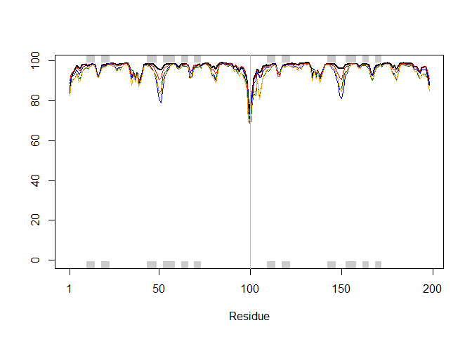
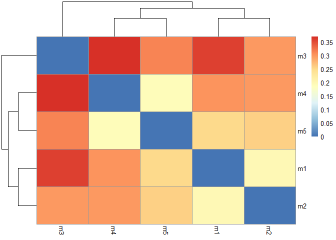
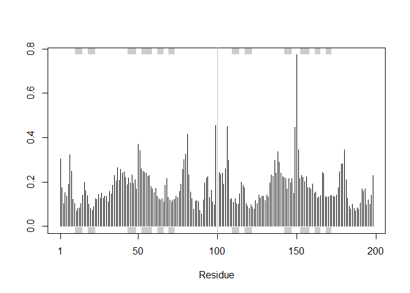
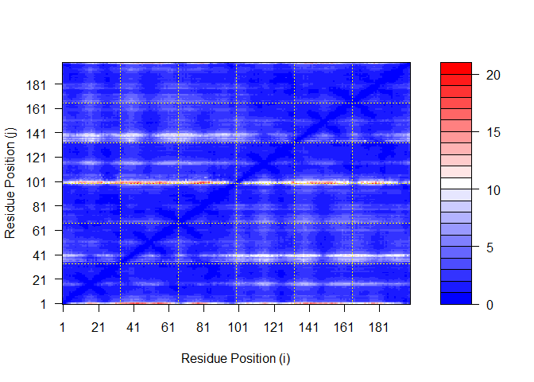
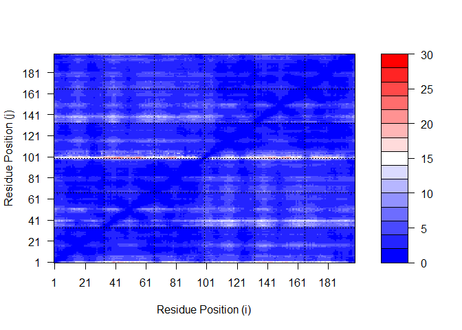
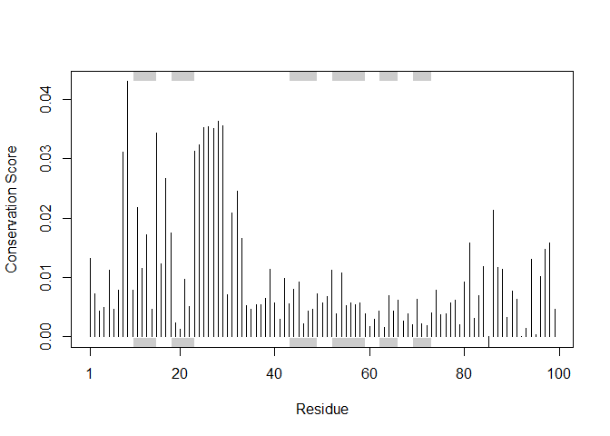

# Class 11: AlphaFold
Peter

- [HIV-Pr-dimer](#hiv-pr-dimer)
- [Bos Indicus (Find a Gene)](#bos-indicus-find-a-gene)

## HIV-Pr-dimer

``` r
library(bio3d)
```

``` r
pth <- "HIVPrdimer_a4e10/"
pdb.files <- list.files(path=pth, full.names=TRUE, pattern=".pdb")
```

``` r
file.exists(pdb.files)
```

    [1] TRUE TRUE TRUE TRUE TRUE

``` r
pdbs <- pdbaln(pdb.files, fit=TRUE, exefile="msa")
```

    Reading PDB files:
    HIVPrdimer_a4e10/HIVPrdimer_a4e10_unrelaxed_rank_001_alphafold2_ptm_model_5_seed_000.pdb
    HIVPrdimer_a4e10/HIVPrdimer_a4e10_unrelaxed_rank_002_alphafold2_ptm_model_3_seed_000.pdb
    HIVPrdimer_a4e10/HIVPrdimer_a4e10_unrelaxed_rank_003_alphafold2_ptm_model_4_seed_000.pdb
    HIVPrdimer_a4e10/HIVPrdimer_a4e10_unrelaxed_rank_004_alphafold2_ptm_model_1_seed_000.pdb
    HIVPrdimer_a4e10/HIVPrdimer_a4e10_unrelaxed_rank_005_alphafold2_ptm_model_2_seed_000.pdb
    .....

    Extracting sequences

    pdb/seq: 1   name: HIVPrdimer_a4e10/HIVPrdimer_a4e10_unrelaxed_rank_001_alphafold2_ptm_model_5_seed_000.pdb 
    pdb/seq: 2   name: HIVPrdimer_a4e10/HIVPrdimer_a4e10_unrelaxed_rank_002_alphafold2_ptm_model_3_seed_000.pdb 
    pdb/seq: 3   name: HIVPrdimer_a4e10/HIVPrdimer_a4e10_unrelaxed_rank_003_alphafold2_ptm_model_4_seed_000.pdb 
    pdb/seq: 4   name: HIVPrdimer_a4e10/HIVPrdimer_a4e10_unrelaxed_rank_004_alphafold2_ptm_model_1_seed_000.pdb 
    pdb/seq: 5   name: HIVPrdimer_a4e10/HIVPrdimer_a4e10_unrelaxed_rank_005_alphafold2_ptm_model_2_seed_000.pdb 

``` r
rd <- rmsd(pdbs, fit=T)
```

    Warning in rmsd(pdbs, fit = T): No indices provided, using the 198 non NA positions

``` r
pdb <- read.pdb("1hsg")
```

      Note: Accessing on-line PDB file

``` r
plotb3(pdbs$b[1,], typ="l", lwd=2, sse=pdb)
points(pdbs$b[2,], typ="l", col="red")
points(pdbs$b[3,], typ="l", col="blue")
points(pdbs$b[4,], typ="l", col="darkgreen")
points(pdbs$b[5,], typ="l", col="orange")
abline(v=100, col="gray")
```



``` r
results_dir <- "HIVPrdimer_a4e10/" 
```

``` r
pdb_files <- list.files(path=results_dir,
                        pattern="*.pdb",
                        full.names = TRUE)
basename(pdb_files)
```

    [1] "HIVPrdimer_a4e10_unrelaxed_rank_001_alphafold2_ptm_model_5_seed_000.pdb"
    [2] "HIVPrdimer_a4e10_unrelaxed_rank_002_alphafold2_ptm_model_3_seed_000.pdb"
    [3] "HIVPrdimer_a4e10_unrelaxed_rank_003_alphafold2_ptm_model_4_seed_000.pdb"
    [4] "HIVPrdimer_a4e10_unrelaxed_rank_004_alphafold2_ptm_model_1_seed_000.pdb"
    [5] "HIVPrdimer_a4e10_unrelaxed_rank_005_alphafold2_ptm_model_2_seed_000.pdb"

``` r
pdbs <- pdbaln(pdb_files, fit=TRUE, exefile="msa")
```

    Reading PDB files:
    HIVPrdimer_a4e10/HIVPrdimer_a4e10_unrelaxed_rank_001_alphafold2_ptm_model_5_seed_000.pdb
    HIVPrdimer_a4e10/HIVPrdimer_a4e10_unrelaxed_rank_002_alphafold2_ptm_model_3_seed_000.pdb
    HIVPrdimer_a4e10/HIVPrdimer_a4e10_unrelaxed_rank_003_alphafold2_ptm_model_4_seed_000.pdb
    HIVPrdimer_a4e10/HIVPrdimer_a4e10_unrelaxed_rank_004_alphafold2_ptm_model_1_seed_000.pdb
    HIVPrdimer_a4e10/HIVPrdimer_a4e10_unrelaxed_rank_005_alphafold2_ptm_model_2_seed_000.pdb
    .....

    Extracting sequences

    pdb/seq: 1   name: HIVPrdimer_a4e10/HIVPrdimer_a4e10_unrelaxed_rank_001_alphafold2_ptm_model_5_seed_000.pdb 
    pdb/seq: 2   name: HIVPrdimer_a4e10/HIVPrdimer_a4e10_unrelaxed_rank_002_alphafold2_ptm_model_3_seed_000.pdb 
    pdb/seq: 3   name: HIVPrdimer_a4e10/HIVPrdimer_a4e10_unrelaxed_rank_003_alphafold2_ptm_model_4_seed_000.pdb 
    pdb/seq: 4   name: HIVPrdimer_a4e10/HIVPrdimer_a4e10_unrelaxed_rank_004_alphafold2_ptm_model_1_seed_000.pdb 
    pdb/seq: 5   name: HIVPrdimer_a4e10/HIVPrdimer_a4e10_unrelaxed_rank_005_alphafold2_ptm_model_2_seed_000.pdb 

``` r
library(pheatmap)

colnames(rd) <- paste0("m",1:5)
rownames(rd) <- paste0("m",1:5)
pheatmap(rd)
```



We can improve the superposition/fitting of our models by finding the
most consistent “rigid core” common across all the models. For this we
will use the core.find() function:

``` r
core.inds <- core.find(pdbs)
```

     core size 197 of 198  vol = 0.329 
     FINISHED: Min vol ( 0.5 ) reached

``` r
xyz <- pdbfit(pdbs, core.inds, outpath="corefit_structures")
```

``` r
rf <- rmsf(xyz)

plotb3(rf, sse=pdb)
abline(v=100, col="gray", ylab="RMSF")
```



Independent of the 3D structure, AlphaFold produces an output called
Predicted Aligned Error (PAE). This is detailed in the JSON format
result files, one for each model structure.

``` r
library(jsonlite)

# Listing of all PAE JSON files
pae_files <- list.files(path=results_dir,
                        pattern=".*model.*\\.json",
                        full.names = TRUE)
```

``` r
pae1 <- read_json(pae_files[1],simplifyVector = TRUE)
pae5 <- read_json(pae_files[5],simplifyVector = TRUE)

attributes(pae1)
```

    $names
    [1] "plddt"   "max_pae" "pae"     "ptm"    

``` r
head(pae1$plddt) 
```

    [1] 83.69 91.56 94.44 95.38 97.44 96.38

``` r
pae1$max_pae
```

    [1] 21

``` r
pae5$max_pae
```

    [1] 24.98438

``` r
plot.dmat(pae1$pae, 
          xlab="Residue Position (i)",
          ylab="Residue Position (j)")
```



``` r
plot.dmat(pae5$pae, 
          xlab="Residue Position (i)",
          ylab="Residue Position (j)",
          grid.col = "black",
          zlim=c(0,30))
```



``` r
aln_file <- list.files(path=results_dir,
                       pattern=".a3m$",
                        full.names = TRUE)
aln_file
```

    [1] "HIVPrdimer_a4e10/HIVPrdimer_a4e10.a3m"

``` r
aln <- read.fasta(aln_file[1], to.upper = TRUE)
```

    [1] " ** Duplicated sequence id's: 101 **"

``` r
dim(aln$ali)
```

    [1] 4309  257

``` r
sim <- conserv(aln)
plotb3(sim[1:99], sse=trim.pdb(pdb, chain="A"),
       ylab="Conservation Score")
```



``` r
con <- consensus(aln, cutoff = 0.9)
con$seq
```

      [1] "-" "-" "-" "-" "-" "-" "-" "-" "-" "-" "-" "-" "-" "-" "-" "-" "-" "-"
     [19] "-" "-" "-" "-" "-" "-" "-" "-" "-" "-" "-" "-" "-" "-" "-" "-" "-" "-"
     [37] "-" "-" "-" "-" "-" "-" "-" "-" "-" "-" "-" "-" "-" "-" "-" "-" "-" "-"
     [55] "-" "-" "-" "-" "-" "-" "-" "-" "-" "-" "-" "-" "-" "-" "-" "-" "-" "-"
     [73] "-" "-" "-" "-" "-" "-" "-" "-" "-" "-" "-" "-" "-" "-" "-" "-" "-" "-"
     [91] "-" "-" "-" "-" "-" "-" "-" "-" "-" "-" "-" "-" "-" "-" "-" "-" "-" "-"
    [109] "-" "-" "-" "-" "-" "-" "-" "-" "-" "-" "-" "-" "-" "-" "-" "-" "-" "-"
    [127] "-" "-" "-" "-" "-" "-" "-" "-" "-" "-" "-" "-" "-" "-" "-" "-" "-" "-"
    [145] "-" "-" "-" "-" "-" "-" "-" "-" "-" "-" "-" "-" "-" "-" "-" "-" "-" "-"
    [163] "-" "-" "-" "-" "-" "-" "-" "-" "-" "-" "-" "-" "-" "-" "-" "-" "-" "-"
    [181] "-" "-" "-" "-" "-" "-" "-" "-" "-" "-" "-" "-" "-" "-" "-" "-" "-" "-"
    [199] "-" "-" "-" "-" "-" "-" "-" "-" "-" "-" "-" "-" "-" "-" "-" "-" "-" "-"
    [217] "-" "-" "-" "-" "-" "-" "-" "-" "-" "-" "-" "-" "-" "-" "-" "-" "-" "-"
    [235] "-" "-" "-" "-" "-" "-" "-" "-" "-" "-" "-" "-" "-" "-" "-" "-" "-" "-"
    [253] "-" "-" "-" "-" "-"

## Bos Indicus (Find a Gene)
