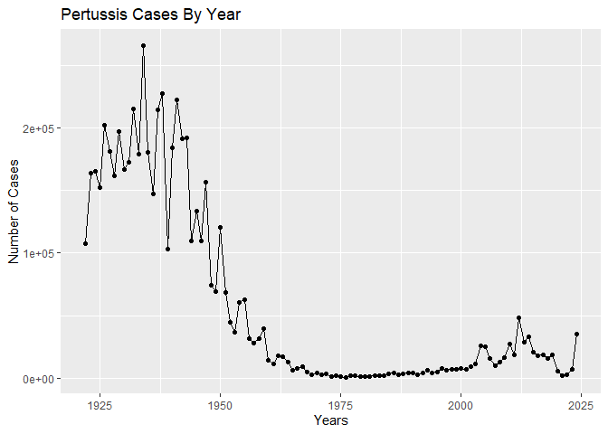
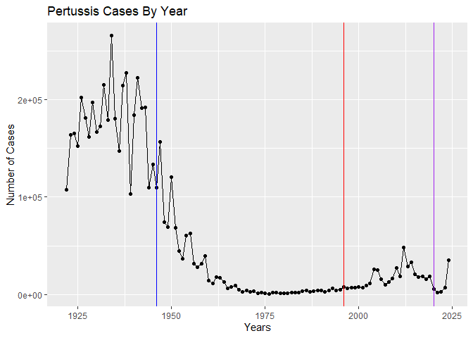
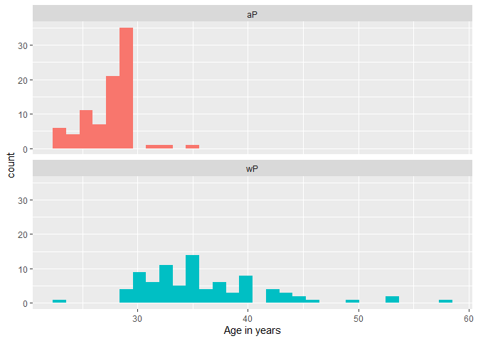
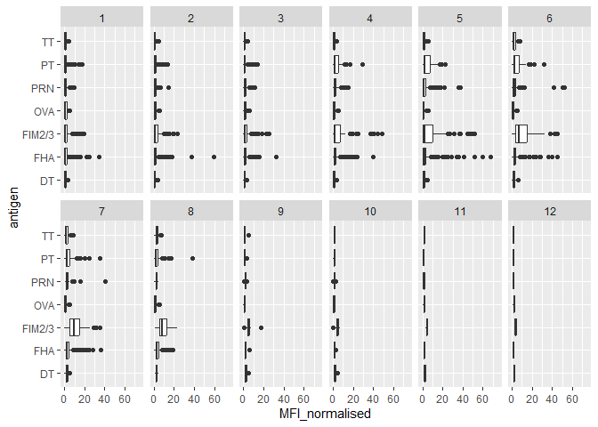
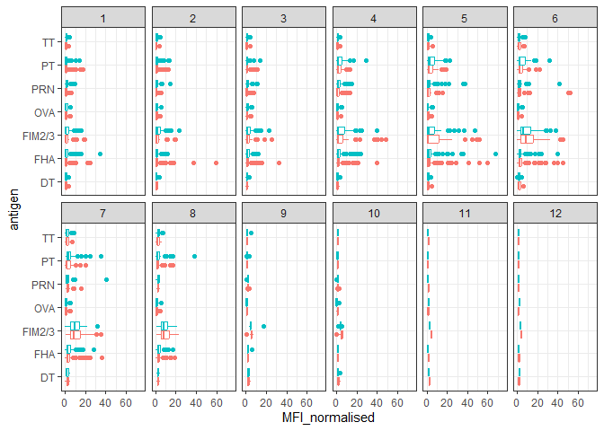
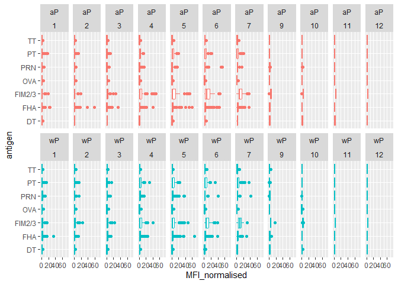
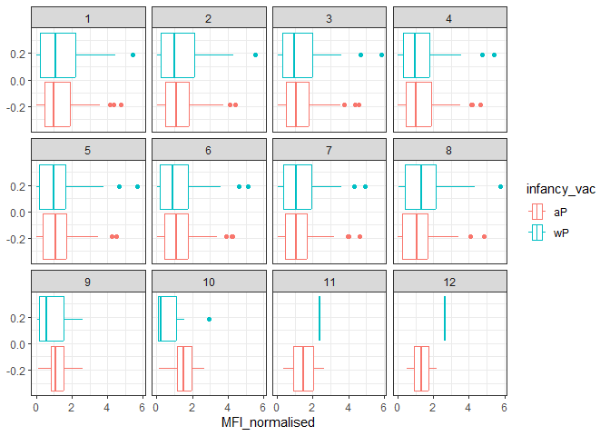
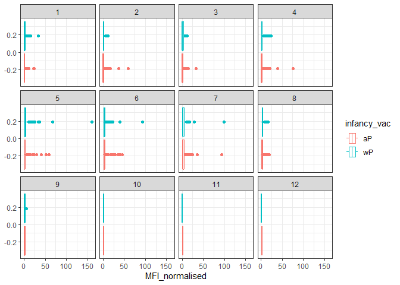
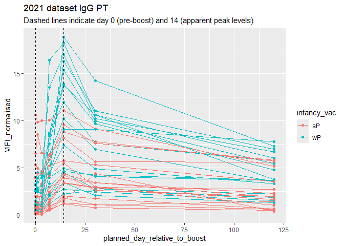
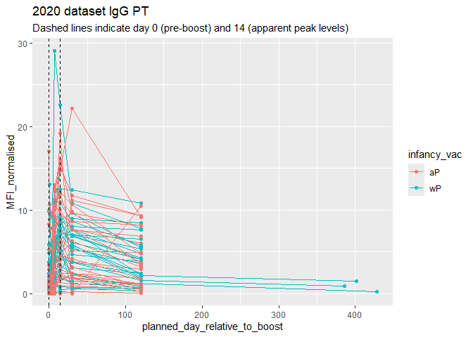

# Class18 - Pertussis
Peter

- [Background](#background)
- [Investigating Pertussis cases by
  year](#investigating-pertussis-cases-by-year)
- [Exploring CMI-PB data](#exploring-cmi-pb-data)
  - [Using lubridate](#using-lubridate)
  - [Joining multiple tables](#joining-multiple-tables)
- [Examine the IgG Ab titer levels](#examine-the-igg-ab-titer-levels)
- [Obtaining CMI-PB RNASeq Data](#obtaining-cmi-pb-rnaseq-data)

## Background

Pertussis (a.k.a. Whooping cough) is a common lung infection caused by
the bacteria *B. Pertussis*.

The CDC tracks cases of Pertussis in the US

## Investigating Pertussis cases by year

``` r
library(datapasta)
```

> Q1. Plot the number of cases per year using ggplot

``` r
library(ggplot2)
plot <- ggplot(cdc) + 
  aes(Year, Cases) +
  geom_point() + 
  geom_line() +
  labs(title="Pertussis Cases By Year", x="Years", y="Number of Cases")
plot
```



> Q2. Add some key time points in the history of the pertussis vaccine.
> Include the wP roll out (first vaccine) in 1946 and the switch to aP
> in 1996.

``` r
plot + 
  geom_vline(xintercept=1946, col="blue") +
  geom_vline(xintercept=1996, col="red") +
  geom_vline(xintercept=2020, col="purple")
```



After the wP vaccine, cases decreased dramatically. Cases remained
stagnant after the switch to the aP vaccine. There were some outbreaks
during the early 2010s, but case numbers dropped during COVID-19. The
current trends suggest Pertussis is making a bit of a comeback.

> Q3. Describe what happened after the introduction of the aP vaccine?
> Do you have a possible explanation for the observed trend?

Trends suggest that switching to the aP vaccine reduced vaccine
hesitancy and it provided protection inferior to the wP vaccine. The
change was originally made due to side effects of the wP vaccine, but
this came with the consequence of potential reduced efficacy.

## Exploring CMI-PB data

CMI-PB stands for Computational Models of Immunity - Pertussis Boost.
Its major goal is to investigate how the immune system responds
differently with the aP or wP vaccine.

``` r
library(jsonlite)
subject <- read_json("https://www.cmi-pb.org/api/subject", simplifyVector = TRUE)
head(subject)
```

      subject_id infancy_vac biological_sex              ethnicity  race
    1          1          wP         Female Not Hispanic or Latino White
    2          2          wP         Female Not Hispanic or Latino White
    3          3          wP         Female                Unknown White
    4          4          wP           Male Not Hispanic or Latino Asian
    5          5          wP           Male Not Hispanic or Latino Asian
    6          6          wP         Female Not Hispanic or Latino White
      year_of_birth date_of_boost      dataset
    1    1986-01-01    2016-09-12 2020_dataset
    2    1968-01-01    2019-01-28 2020_dataset
    3    1983-01-01    2016-10-10 2020_dataset
    4    1988-01-01    2016-08-29 2020_dataset
    5    1991-01-01    2016-08-29 2020_dataset
    6    1988-01-01    2016-10-10 2020_dataset

> Q4. How many aP and wP infancy vaccinated subjects are in the dataset?

``` r
table(subject$infancy_vac)
```


    aP wP 
    87 85 

> Q5. How many Male and Female subjects/patients are in the dataset?

``` r
table(subject$biological_sex)
```


    Female   Male 
       112     60 

> Q6. What is the breakdown of race and biological sex (e.g. number of
> Asian females, White males etc…)?

``` r
table(subject$race, subject$biological_sex)
```

                                               
                                                Female Male
      American Indian/Alaska Native                  0    1
      Asian                                         32   12
      Black or African American                      2    3
      More Than One Race                            15    4
      Native Hawaiian or Other Pacific Islander      1    1
      Unknown or Not Reported                       14    7
      White                                         48   32

### Using lubridate

``` r
library(lubridate)
```


    Attaching package: 'lubridate'

    The following objects are masked from 'package:base':

        date, intersect, setdiff, union

``` r
today() - ymd("2000-01-01")
```

    Time difference of 9287 days

``` r
time_length( today() - ymd("2000-01-01"),  "years")
```

    [1] 25.42642

> Q7. Using this approach determine (i) the average age of wP
> individuals, (ii) the average age of aP individuals; and (iii) are
> they significantly different?

1)  

``` r
library(dplyr)
```


    Attaching package: 'dplyr'

    The following objects are masked from 'package:stats':

        filter, lag

    The following objects are masked from 'package:base':

        intersect, setdiff, setequal, union

``` r
subject$age <- today() - ymd(subject$year_of_birth)
wP <- subject %>% filter(infancy_vac == "wP")
round( summary( time_length( wP$age, "years" ) ) )
```

       Min. 1st Qu.  Median    Mean 3rd Qu.    Max. 
         22      32      34      36      39      57 

2)  

``` r
subject$age <- today() - ymd(subject$year_of_birth)
aP <- subject %>% filter(infancy_vac == "aP")
round( summary( time_length( aP$age, "years" ) ) )
```

       Min. 1st Qu.  Median    Mean 3rd Qu.    Max. 
         22      26      27      27      28      34 

3)  

``` r
p <- t.test(time_length(aP$age, "years"), time_length(wP$age, "years"))
p$p.value
```

    [1] 2.372101e-23

> Q8. Determine the age of all individuals at time of boost.

``` r
int <- ymd(subject$date_of_boost) - ymd(subject$year_of_birth)
age_at_boost <- time_length(int, "year")
head(age_at_boost)
```

    [1] 30.69678 51.07461 33.77413 28.65982 25.65914 28.77481

> Q9. With the help of a faceted boxplot or histogram (see below), do
> you think these two groups are significantly different?

``` r
ggplot(subject) +
  aes(time_length(age, "year"),
      fill=as.factor(infancy_vac)) +
  geom_histogram(show.legend=FALSE) +
  facet_wrap(vars(infancy_vac), nrow=2) +
  xlab("Age in years")
```

    `stat_bin()` using `bins = 30`. Pick better value with `binwidth`.



They appear to be very different, and the p-value we got in question 7
(iii) is statistically significant.

### Joining multiple tables

``` r
specimen <- read_json("http://cmi-pb.org/api/v5_1/specimen", simplifyVector = TRUE) 
titer <- read_json("https://www.cmi-pb.org/api/v5_1/plasma_ab_titer", simplifyVector = TRUE)
```

> Q9. Complete the code to join specimen and subject tables to make a
> new merged data frame containing all specimen records along with their
> associated subject details:

``` r
meta <- inner_join(subject, specimen)
```

    Joining with `by = join_by(subject_id)`

``` r
dim(meta)
```

    [1] 1503   14

``` r
head(meta)
```

      subject_id infancy_vac biological_sex              ethnicity  race
    1          1          wP         Female Not Hispanic or Latino White
    2          1          wP         Female Not Hispanic or Latino White
    3          1          wP         Female Not Hispanic or Latino White
    4          1          wP         Female Not Hispanic or Latino White
    5          1          wP         Female Not Hispanic or Latino White
    6          1          wP         Female Not Hispanic or Latino White
      year_of_birth date_of_boost      dataset        age specimen_id
    1    1986-01-01    2016-09-12 2020_dataset 14400 days           1
    2    1986-01-01    2016-09-12 2020_dataset 14400 days           2
    3    1986-01-01    2016-09-12 2020_dataset 14400 days           3
    4    1986-01-01    2016-09-12 2020_dataset 14400 days           4
    5    1986-01-01    2016-09-12 2020_dataset 14400 days           5
    6    1986-01-01    2016-09-12 2020_dataset 14400 days           6
      actual_day_relative_to_boost planned_day_relative_to_boost specimen_type
    1                           -3                             0         Blood
    2                            1                             1         Blood
    3                            3                             3         Blood
    4                            7                             7         Blood
    5                           11                            14         Blood
    6                           32                            30         Blood
      visit
    1     1
    2     2
    3     3
    4     4
    5     5
    6     6

> Q10. Now using the same procedure join meta with titer data so we can
> further analyze this data in terms of time of visit aP/wP, male/female
> etc

``` r
abdata <- inner_join(titer, meta)
```

    Joining with `by = join_by(specimen_id)`

``` r
head(abdata)
```

      specimen_id isotype is_antigen_specific antigen        MFI MFI_normalised
    1           1     IgE               FALSE   Total 1110.21154       2.493425
    2           1     IgE               FALSE   Total 2708.91616       2.493425
    3           1     IgG                TRUE      PT   68.56614       3.736992
    4           1     IgG                TRUE     PRN  332.12718       2.602350
    5           1     IgG                TRUE     FHA 1887.12263      34.050956
    6           1     IgE                TRUE     ACT    0.10000       1.000000
       unit lower_limit_of_detection subject_id infancy_vac biological_sex
    1 UG/ML                 2.096133          1          wP         Female
    2 IU/ML                29.170000          1          wP         Female
    3 IU/ML                 0.530000          1          wP         Female
    4 IU/ML                 6.205949          1          wP         Female
    5 IU/ML                 4.679535          1          wP         Female
    6 IU/ML                 2.816431          1          wP         Female
                   ethnicity  race year_of_birth date_of_boost      dataset
    1 Not Hispanic or Latino White    1986-01-01    2016-09-12 2020_dataset
    2 Not Hispanic or Latino White    1986-01-01    2016-09-12 2020_dataset
    3 Not Hispanic or Latino White    1986-01-01    2016-09-12 2020_dataset
    4 Not Hispanic or Latino White    1986-01-01    2016-09-12 2020_dataset
    5 Not Hispanic or Latino White    1986-01-01    2016-09-12 2020_dataset
    6 Not Hispanic or Latino White    1986-01-01    2016-09-12 2020_dataset
             age actual_day_relative_to_boost planned_day_relative_to_boost
    1 14400 days                           -3                             0
    2 14400 days                           -3                             0
    3 14400 days                           -3                             0
    4 14400 days                           -3                             0
    5 14400 days                           -3                             0
    6 14400 days                           -3                             0
      specimen_type visit
    1         Blood     1
    2         Blood     1
    3         Blood     1
    4         Blood     1
    5         Blood     1
    6         Blood     1

> Q11. How many specimens (i.e. entries in abdata) do we have for each
> isotype?

``` r
dim(abdata)
```

    [1] 61956    21

``` r
table(abdata$isotype)
```


      IgE   IgG  IgG1  IgG2  IgG3  IgG4 
     6698  7265 11993 12000 12000 12000 

> Q12. What are the different \$dataset values in abdata and what do you
> notice about the number of rows for the most “recent” dataset?

``` r
table(abdata$dataset)
```


    2020_dataset 2021_dataset 2022_dataset 2023_dataset 
           31520         8085         7301        15050 

There are more than double the amount of the previous year…

> Make a boxplot of antigen levels across the whole dataset (MFI vs
> antigen).

``` r
ggplot(abdata) + 
  aes(MFI, antigen) + 
  geom_boxplot()
```

    Warning: Removed 1 row containing non-finite outside the scale range
    (`stat_boxplot()`).


## Examine the IgG Ab titer levels

``` r
igg <- abdata %>% filter(isotype == "IgG")
head(igg)
```

      specimen_id isotype is_antigen_specific antigen        MFI MFI_normalised
    1           1     IgG                TRUE      PT   68.56614       3.736992
    2           1     IgG                TRUE     PRN  332.12718       2.602350
    3           1     IgG                TRUE     FHA 1887.12263      34.050956
    4          19     IgG                TRUE      PT   20.11607       1.096366
    5          19     IgG                TRUE     PRN  976.67419       7.652635
    6          19     IgG                TRUE     FHA   60.76626       1.096457
       unit lower_limit_of_detection subject_id infancy_vac biological_sex
    1 IU/ML                 0.530000          1          wP         Female
    2 IU/ML                 6.205949          1          wP         Female
    3 IU/ML                 4.679535          1          wP         Female
    4 IU/ML                 0.530000          3          wP         Female
    5 IU/ML                 6.205949          3          wP         Female
    6 IU/ML                 4.679535          3          wP         Female
                   ethnicity  race year_of_birth date_of_boost      dataset
    1 Not Hispanic or Latino White    1986-01-01    2016-09-12 2020_dataset
    2 Not Hispanic or Latino White    1986-01-01    2016-09-12 2020_dataset
    3 Not Hispanic or Latino White    1986-01-01    2016-09-12 2020_dataset
    4                Unknown White    1983-01-01    2016-10-10 2020_dataset
    5                Unknown White    1983-01-01    2016-10-10 2020_dataset
    6                Unknown White    1983-01-01    2016-10-10 2020_dataset
             age actual_day_relative_to_boost planned_day_relative_to_boost
    1 14400 days                           -3                             0
    2 14400 days                           -3                             0
    3 14400 days                           -3                             0
    4 15496 days                           -3                             0
    5 15496 days                           -3                             0
    6 15496 days                           -3                             0
      specimen_type visit
    1         Blood     1
    2         Blood     1
    3         Blood     1
    4         Blood     1
    5         Blood     1
    6         Blood     1

> Q13. Complete the following code to make a summary boxplot of Ab titer
> levels (MFI) for all antigens:

``` r
ggplot(igg) +
  aes(MFI_normalised, antigen) +
  geom_boxplot() + 
    xlim(0,75) +
  facet_wrap(vars(visit), nrow=2)
```

    Warning: Removed 5 rows containing non-finite outside the scale range
    (`stat_boxplot()`).



> Q14. What antigens show differences in the level of IgG antibody
> titers recognizing them over time? Why these and not others?

Antigens PT, PRN, FIM2/3, and FHA show considerable differences over
time. Thus could be due to the fact that they are antigens specific to
Pertussis, while DT and TT are present in the DTAP vaccine for
Diphtheria and Tetanus, not pertussis necessarily

``` r
ggplot(igg) +
  aes(MFI_normalised, antigen, col=infancy_vac ) +
  geom_boxplot(show.legend = FALSE) + 
  facet_wrap(vars(visit), nrow=2) +
  xlim(0,75) +
  theme_bw()
```

    Warning: Removed 5 rows containing non-finite outside the scale range
    (`stat_boxplot()`).



``` r
igg %>% filter(visit != 8) %>%
ggplot() +
  aes(MFI_normalised, antigen, col=infancy_vac ) +
  geom_boxplot(show.legend = FALSE) + 
  xlim(0,75) +
  facet_wrap(vars(infancy_vac, visit), nrow=2)
```

    Warning: Removed 5 rows containing non-finite outside the scale range
    (`stat_boxplot()`).



> Q15. Filter to pull out only two specific antigens for analysis and
> create a boxplot for each. You can chose any you like. Below I picked
> a “control” antigen (“OVA”, that is not in our vaccines) and a clear
> antigen of interest (“PT”, Pertussis Toxin, one of the key virulence
> factors produced by the bacterium B. pertussis).

``` r
filter(igg, antigen=="OVA") %>%
  ggplot() +
  aes(MFI_normalised, col=infancy_vac) +
  geom_boxplot(show.legend = TRUE) +
  facet_wrap(vars(visit)) +
  theme_bw()
```



``` r
filter(igg, antigen=="FHA") %>%
  ggplot() +
  aes(MFI_normalised, col=infancy_vac) +
  geom_boxplot(show.legend = TRUE) +
  facet_wrap(vars(visit)) +
  theme_bw()
```



> Q16. What do you notice about these two antigens time courses and the
> PT data in particular?

The OVA time course is less interesting than that of the PT time course,
where at the 8th time point the aP values were replaced with wP such
that the entire plot is wP. I personally compared OVA to FHA, where this
phenomenon was not observed.

> Q17. Do you see any clear difference in aP vs. wP responses?

Besides the strange data at time point 8, there does not appear to be
signicant difference in the time trajectory of wP vs aP.

``` r
abdata.21 <- abdata %>% filter(dataset == "2021_dataset")

abdata.21 %>% 
  filter(isotype == "IgG",  antigen == "PT") %>%
  ggplot() +
    aes(x=planned_day_relative_to_boost,
        y=MFI_normalised,
        col=infancy_vac,
        group=subject_id) +
    geom_point() +
    geom_line() +
    geom_vline(xintercept=0, linetype="dashed") +
    geom_vline(xintercept=14, linetype="dashed") +
  labs(title="2021 dataset IgG PT",
       subtitle = "Dashed lines indicate day 0 (pre-boost) and 14 (apparent peak levels)")
```



``` r
abdata.20 <- abdata %>% filter(dataset == "2020_dataset")

abdata.20 %>% 
  filter(isotype == "IgG",  antigen == "PT") %>%
  ggplot() +
    aes(x=planned_day_relative_to_boost,
        y=MFI_normalised,
        col=infancy_vac,
        group=subject_id) +
    geom_point() +
    geom_line() +
    geom_vline(xintercept=0, linetype="dashed") +
    geom_vline(xintercept=14, linetype="dashed") +
  labs(title="2020 dataset IgG PT",
       subtitle = "Dashed lines indicate day 0 (pre-boost) and 14 (apparent peak levels)")
```



> Q18. Does this trend look similar for the 2020 dataset?

Absolutely not. The 2020 dataset sees an abrupt change around day 115ish
where values for aP halt and wP values slowly approach 0 over a longer
period of time. The behavior of aP in particular is much different in
the 2021 dataset where it is more gradual.

## Obtaining CMI-PB RNASeq Data

For RNA-Seq data the API query mechanism quickly hits the web browser
interface limit for file size. We will present alternative download
mechanisms for larger CMI-PB datasets in the next section. However, we
can still do “targeted” RNA-Seq querys via the web accessible API.

``` r
url <- "https://www.cmi-pb.org/api/v2/rnaseq?versione>d_ensembl_gene_id=eq.ENSG00000211896.7"
#rna <- read_json(url, simplifyVector = TRUE) 
```

To facilitate further analysis we need to “join” the rna expression data
with our metadata meta, which is itself a join of sample and specimen
data. This will allow us to look at this genes TPM expression values
over aP/wP status and at different visits (i.e. times):

``` r
#meta <- inner_join(specimen, subject)
#ssrna <- inner_join(rna, meta)
```

> Q19. Make a plot of the time course of gene expression for IGHG1 gene
> (i.e. a plot of visit vs. tpm).

``` r
#ggplot(ssrna) +
  aes(visit, tpm, group=subject_id) +
  geom_point() +
  geom_line(alpha=0.2)
```

    NULL

> Q20. What do you notice about the expression of this gene (i.e. when
> is it at it’s maximum level)?

It trends higher towards the middle rather than peaking initially or
gradually rising to a larger peak as time progresses

> Q21. Does this pattern in time match the trend of antibody titer data?
> If not, why not?

It does especially for PT which peaked around time point 5 according to
the previous boxplot data

``` r
#ggplot(ssrna) +
  aes(tpm, col=infancy_vac) +
  geom_boxplot() +
  facet_wrap(vars(visit))
```

    NULL

``` r
#ssrna %>%  
  filter(visit==4) %>% 
  #ggplot() +
    aes(tpm, col=infancy_vac) + geom_density() + 
    geom_rug() 
```

    NULL

**I was originally able to plot all of the graphs (specifically the one
for Q19) but the internet connection would not render them so I just
hashed all of the code that I used. I was able to analyze the plots
easily because they were identical to the ones on the lab sheet**
